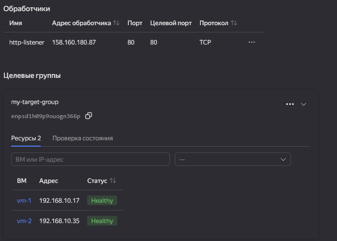
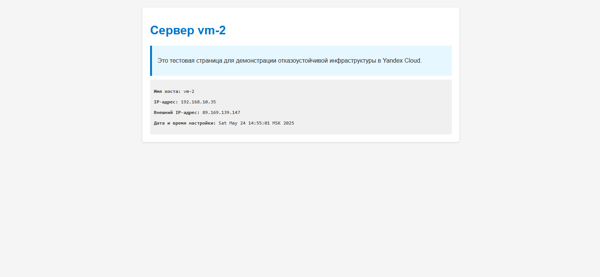
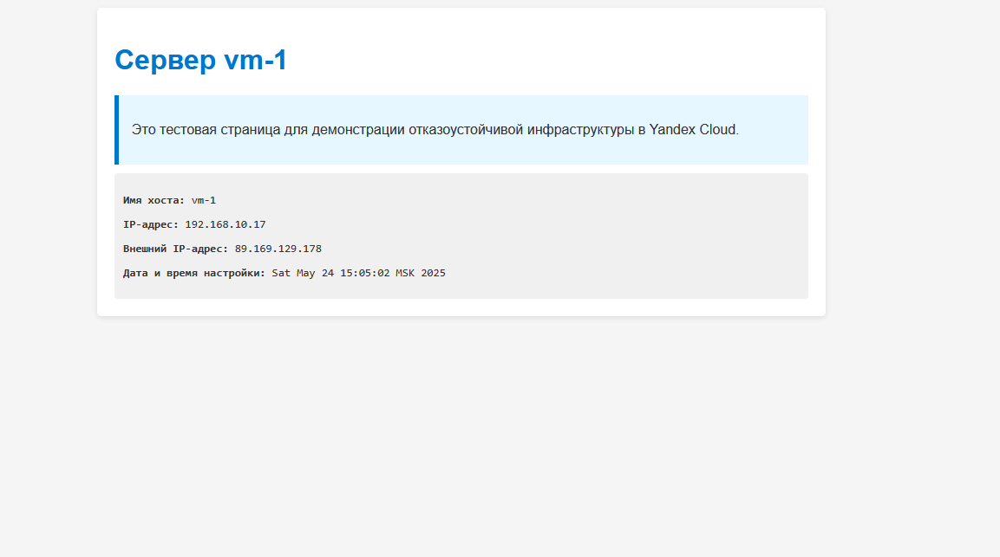

# 🌐 Домашнее задание к занятию «Отказоустойчивость в облаке»


## 📋 Содержание

- [Описание проекта](#-описание-проекта)
- [Архитектура решения](#-архитектура-решения)
- [Предварительные требования](#-предварительные-требования)
- [Установка и настройка](#-установка-и-настройка)
- [Структура проекта](#-структура-проекта)
- [Конфигурация Terraform](#-конфигурация-terraform)
- [Результаты выполнения](#-результаты-выполнения)
- [Проверка работоспособности](#-проверка-работоспособности)
- [Мониторинг и отладка](#-мониторинг-и-отладка)
- [Очистка ресурсов](#-очистка-ресурсов)

## 🎯 Описание проекта

Данный проект представляет собой практическое задание по созданию отказоустойчивой инфраструктуры в **Yandex Cloud** с использованием **Terraform**. Основная цель — продемонстрировать принципы высокой доступности и распределения нагрузки в облачной среде.

### Основные задачи:
- ✅ Создание двух идентичных виртуальных машин для обеспечения отказоустойчивости
- ✅ Настройка сетевого балансировщика нагрузки для распределения трафика
- ✅ Автоматическая установка и настройка веб-серверов Nginx
- ✅ Реализация проверок работоспособности (health checks)
- ✅ Обеспечение высокой доступности сервиса

## 🏗️ Архитектура решения

```
┌─────────────────────────────────────────────────────────────┐
│                    Yandex Cloud                             │
│  ┌─────────────────────────────────────────────────────────┐ │
│  │                VPC Network                              │ │
│  │  ┌─────────────────────────────────────────────────────┐ │ │
│  │  │              Subnet (192.168.10.0/24)              │ │ │
│  │  │                                                     │ │ │
│  │  │  ┌─────────────┐    ┌─────────────┐                │ │ │
│  │  │  │    VM-1     │    │    VM-2     │                │ │ │
│  │  │  │   Nginx     │    │   Nginx     │                │ │ │
│  │  │  │   :80       │    │   :80       │                │ │ │
│  │  │  └─────────────┘    └─────────────┘                │ │ │
│  │  │         │                   │                      │ │ │
│  │  └─────────┼───────────────────┼──────────────────────┘ │ │
│  └────────────┼───────────────────┼────────────────────────┘ │
│               │                   │                          │
│  ┌────────────┼───────────────────┼────────────────────────┐ │
│  │            │  Target Group     │                        │ │
│  │            └───────┬───────────┘                        │ │
│  │                    │                                    │ │
│  │         ┌──────────┴──────────┐                         │ │
│  │         │  Network Load       │                         │ │
│  │         │  Balancer :80       │                         │ │
│  │         └──────────┬──────────┘                         │ │
│  └────────────────────┼────────────────────────────────────┘ │
└───────────────────────┼──────────────────────────────────────┘
                        │
                 ┌──────┴──────┐
                 │   Internet  │
                 │   Traffic   │
                 └─────────────┘
```

## 📋 Предварительные требования

### Программное обеспечение:
- **Terraform** >= 1.0
- **Yandex Cloud CLI** (опционально, для управления через командную строку)
- **SSH-клиент** для подключения к виртуальным машинам

### Учетные данные Yandex Cloud:
- Активный аккаунт в Yandex Cloud
- Сервисный аккаунт с правами на создание ресурсов
- Файл ключа сервисного аккаунта (`authorized_key.json`)
- SSH-ключи для доступа к виртуальным машинам (`id_rsa.pub`)

### Необходимые разрешения:
- `compute.admin` — для создания виртуальных машин
- `vpc.admin` — для создания сетевых ресурсов
- `load-balancer.admin` — для создания балансировщика нагрузки

## 🚀 Установка и настройка

### 1. Подготовка окружения

```bash
# Клонирование репозитория
git clone https://github.com/kellisfen/Homework-for-the-lesson-Fault-tolerance-in-the-cloud-.git
cd "Homework-for-the-lesson-Fault-tolerance-in-the-cloud-"

# Создание SSH-ключей (если отсутствуют)
ssh-keygen -t rsa -b 4096 -f id_rsa -N ""
```

### 2. Настройка переменных

Отредактируйте файл `main.tf` и укажите ваши параметры:

```hcl
provider "yandex" {
  service_account_key_file = "path/to/your/authorized_key.json"
  cloud_id                 = "your-cloud-id"
  folder_id                = "your-folder-id"
  zone                     = "ru-central1-a"
}
```

### 3. Инициализация и развертывание

```bash
# Инициализация Terraform
terraform init

# Проверка плана развертывания
terraform plan

# Применение конфигурации
terraform apply
```

## 📁 Структура проекта

```
.
├── README.md                    # Документация проекта
├── main.tf                      # Основная конфигурация Terraform
├── authorized_key.json          # Ключ сервисного аккаунта (не в репозитории)
├── id_rsa.pub                   # Публичный SSH-ключ (не в репозитории)
└── screen/                      # Скриншоты результатов
    ├── 1.png                    # Статус балансировщика и целевой группы
    ├── 2.png                    # Веб-страница сервера VM-1
    └── 3.png                    # Веб-страница сервера VM-2
```

## ⚙️ Конфигурация Terraform

### Основные ресурсы:

#### 🖥️ Виртуальные машины
```hcl
resource "yandex_compute_instance" "vm" {
  count       = 2
  name        = "vm-${count.index + 1}"
  platform_id = "standard-v3"

  resources {
    cores         = 2
    memory        = 2
    core_fraction = 20
  }
  # ... дополнительная конфигурация
}
```

#### 🌐 Сетевая инфраструктура
```hcl
resource "yandex_vpc_network" "network-1" {
  name = "network-otkazoustoichivost"
}

resource "yandex_vpc_subnet" "subnet-1" {
  name           = "subnet1"
  zone           = "ru-central1-a"
  network_id     = yandex_vpc_network.network-1.id
  v4_cidr_blocks = ["192.168.10.0/24"]
}
```

#### ⚖️ Балансировщик нагрузки
```hcl
resource "yandex_lb_network_load_balancer" "lb" {
  name = "my-network-lb"

  listener {
    name        = "http-listener"
    port        = 80
    target_port = 80
    protocol    = "tcp"
  }
  # ... настройки health check
}
```

## 📊 Результаты выполнения

### 1. Статус балансировщика нагрузки и целевой группы

На данном скриншоте показано состояние созданного балансировщика нагрузки в веб-консоли Yandex Cloud. Балансировщик находится в статусе **Active**, а обе виртуальные машины в целевой группе имеют статус **Healthy**, что подтверждает корректную работу системы проверки работоспособности.



### 2. Веб-страница первого сервера (VM-1)

Скриншот демонстрирует успешную работу веб-сервера на первой виртуальной машине. Страница содержит информацию о сервере, включая имя хоста, IP-адреса и время настройки. Это подтверждает, что автоматическая настройка через cloud-init прошла успешно.



### 3. Веб-страница второго сервера (VM-2)

Аналогичная страница второго сервера показывает, что балансировщик нагрузки корректно распределяет трафик между серверами. Каждый сервер имеет уникальную идентификацию, что позволяет отслеживать, на какой именно сервер попал запрос.



## ✅ Проверка работоспособности

### Проверка статуса ресурсов

После развертывания инфраструктуры выполните следующие проверки:

```bash
# Проверка статуса Terraform
terraform show

# Получение выходных переменных
terraform output

# Проверка доступности балансировщика
curl -I http://<LOAD_BALANCER_IP>
```

### Тестирование балансировки нагрузки

```bash
# Множественные запросы для проверки распределения
for i in {1..10}; do
  curl -s http://<LOAD_BALANCER_IP> | grep "Сервер vm-"
  sleep 1
done
```

### Проверка отказоустойчивости

1. **Остановка одного сервера:**
   ```bash
   # Подключение к первой ВМ
   ssh ubuntu@<VM1_IP>
   sudo systemctl stop nginx
   ```

2. **Проверка работы балансировщика:**
   - Убедитесь, что трафик перенаправляется только на работающий сервер
   - Проверьте статус health check в консоли Yandex Cloud

3. **Восстановление сервиса:**
   ```bash
   sudo systemctl start nginx
   ```

## 🔍 Мониторинг и отладка

### Логи и мониторинг

```bash
# Просмотр логов Nginx
sudo tail -f /var/log/nginx/access.log
sudo tail -f /var/log/nginx/error.log

# Проверка статуса сервисов
sudo systemctl status nginx
sudo systemctl status ufw

# Мониторинг ресурсов
htop
df -h
free -h
```

### Полезные команды для отладки

```bash
# Проверка сетевых соединений
sudo netstat -tlnp | grep :80
sudo ss -tlnp | grep :80

# Проверка брандмауэра
sudo ufw status verbose

# Тестирование локального подключения
curl -I localhost:80
```

### Terraform команды для управления

```bash
# Просмотр плана изменений
terraform plan

# Применение изменений
terraform apply

# Уничтожение инфраструктуры
terraform destroy

# Форматирование кода
terraform fmt

# Валидация конфигурации
terraform validate
```

## 🧹 Очистка ресурсов

⚠️ **Важно:** Не забудьте удалить созданные ресурсы после завершения работы, чтобы избежать ненужных расходов.

```bash
# Уничтожение всей инфраструктуры
terraform destroy

# Подтверждение удаления
# Введите "yes" когда система запросит подтверждение
```

### Проверка удаления

После выполнения `terraform destroy` убедитесь в веб-консоли Yandex Cloud, что все ресурсы удалены:

- ✅ Виртуальные машины
- ✅ Балансировщик нагрузки
- ✅ Целевая группа
- ✅ Сетевые ресурсы (VPC, подсеть)

## 📚 Дополнительные материалы

### Документация

- [Terraform Yandex Provider](https://registry.terraform.io/providers/yandex-cloud/yandex/latest/docs)
- [Yandex Cloud Network Load Balancer](https://cloud.yandex.ru/docs/network-load-balancer/)
- [Yandex Cloud Compute](https://cloud.yandex.ru/docs/compute/)
- [Cloud-init документация](https://cloudinit.readthedocs.io/)

### Возможные улучшения

- 🔄 Добавление Application Load Balancer для более продвинутой балансировки
- 🔒 Настройка HTTPS с SSL-сертификатами
- 📊 Интеграция с системами мониторинга (Prometheus, Grafana)
- 🗄️ Добавление базы данных для полноценного веб-приложения
- 🔐 Настройка VPN для безопасного доступа к инфраструктуре
- 📦 Использование Docker для контейнеризации приложений

## 🤝 Поддержка

Если у вас возникли вопросы или проблемы:

1. Проверьте [Issues](https://github.com/kellisfen/Homework-for-the-lesson-Fault-tolerance-in-the-cloud-/issues) в репозитории
2. Создайте новый Issue с подробным описанием проблемы
3. Приложите логи и скриншоты для быстрого решения

---

**Автор:** [kellisfen](https://github.com/kellisfen)
**Лицензия:** MIT
**Дата создания:** 2024
